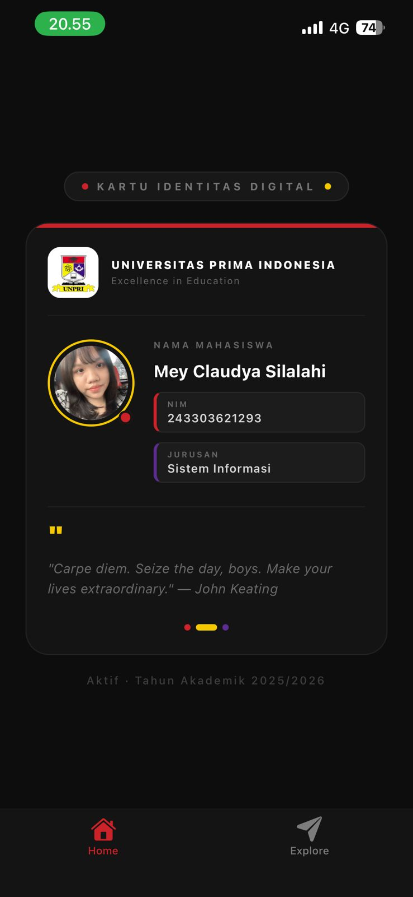

# Project: Kartu Identitas Digital 🪪

Tugas praktikum Pertemuan 2 - Pemrograman Mobile.

## 📸 Screenshots

## 🛠️ Tech Stack
- **Framework:** React Native (Expo SDK 50)
- **Navigation:** Expo Router
- **Language:** TypeScript

## 🚀 Cara Menjalankan
1. Clone repository ini.
2. Jalankan `npm install`.
3. Jalankan `npx expo start`.

## 📋 Fitur
- Kartu Identitas Digital dengan design modern
- Menampilkan profil mahasiswa (Nama, NIM, Jurusan)
- Quote motivasi personal
- Responsive layout dengan SafeAreaView
- Dark theme design

## 👤 Profil Pembuat
- **Nama:** Mey Claudya Silalahi
- **NIM:** 243303621293
- **Jurusan:** Sistem Informasi
